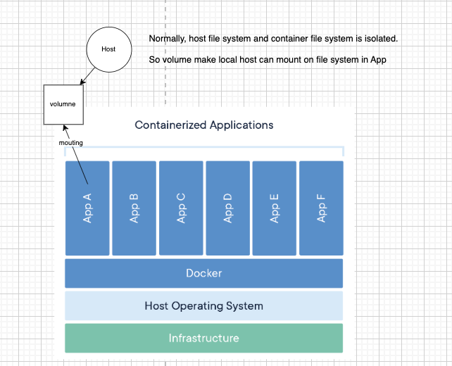
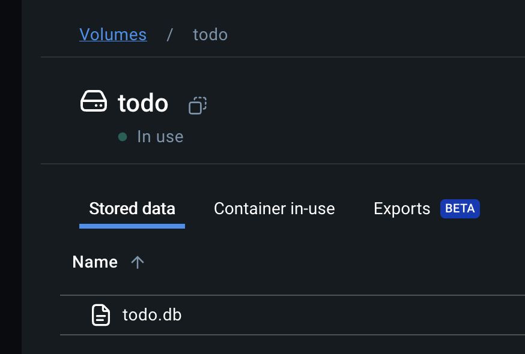

cause each container is seperate and when we remove container, all data in db is vanished.

in order to save those data after you remove container when you are trying to run latest container that have modified is.

`Volume mount`



Concept of `volume` is we created volume to mount `file`or `dir` in container i.g. AppA. Contain or file.

and `local host` or our computer can access to the file too, even we remove the container those file will still exist.

<hr>

### For example

we have file `data.db` in AppA, we create `volume` to mount to `data.db` file.

to create volume.

```bash
docker volume create todo-db
```

So when you rebuild the container, all data in `data.db` still exist with this command.

```bash
docker run -dp 127.0.0.1:3000:3000 --mount type=volume,src=todo-db,target=/etc/todos getting-started
```

src=`volume name`, target=`file to mount`
```bash
--mount type=volume,src=todo-db,target=/etc/todos getting-started
```


To inspect volume 
```bash
docker volume inspect todo-db
```

result

```bash
[
    {
        "CreatedAt": "2024-09-02T10:09:53Z",
        "Driver": "local",
        "Labels": null,
        "Mountpoint": "/var/lib/docker/volumes/todo-db/_data",
        "Name": "todo-db",
        "Options": null,
        "Scope": "local"
    }
]
```



<hr>

source:
https://docs.docker.com/get-started/workshop/05_persisting_data/