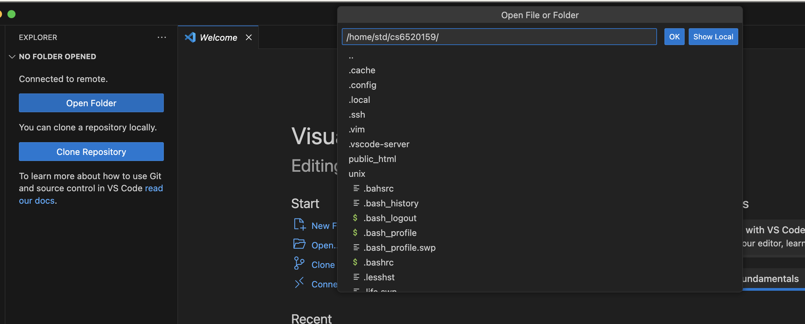

# SSH extension

## มันคือ ?
extension ช่วยให้เเก้ไขไฟล์บน `hostremote` บน `vscode`ที่อยู่บนเครื่องเรา โดย ไม่ต้องใช้ `sftp` put file ขึ้น host 

ตัวอย่าง : https://www.youtube.com/watch?v=Y3qQk_URAzM

## วิธีใข้

1. โหลด

2. connect to host โดยพิมพ์ `ctrl + p + > ` บน window, `cmd + p + >` บน mac
พิมพ์หา `remote-ssh: connet to host`

3. Add host

4. กรอก `username`@`ip` เเละกรอกรหัส

5. ใส่รหัสไป

6. เลือก folder ที่จะทำงาน

เเล้วคราวนี้พอเเก้ อะไีรในไฟล์ก็ตามก็เพียงเเค่ `save` -> `refresh` browser เเล้วก็จะได้หน้าเว็บใหม่โดยไม่ต้องพิมพ์ คำสั่ง `put`

cr: ผู้ค้นพบ ชื่อเล่น fuse